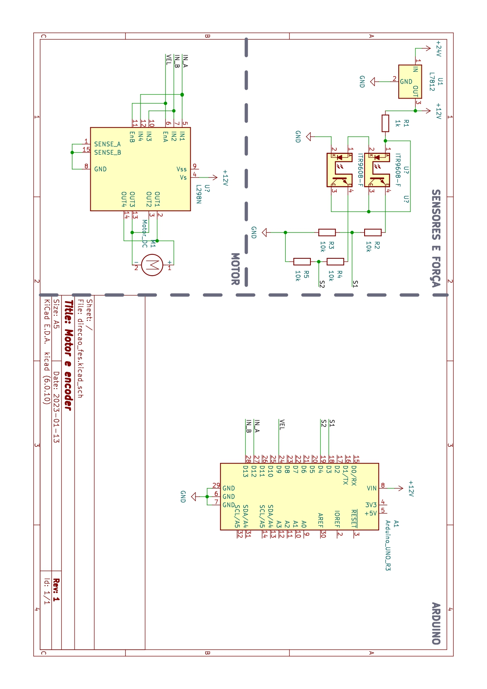

# Então você quer saber mais sobre o Fórmula-E Siará?
## Chassi

## Suspensão

## Sistema de Freio

## Sistema de Propulsão (Powertrain)
### [[Inversor de Frequência]]
## Eletrônica
### Autonomia

Direção

Motor DC 4000 RPM redução 1:8 encoder 15 passos, plataforma: Arduino

### [[Baterias]]
